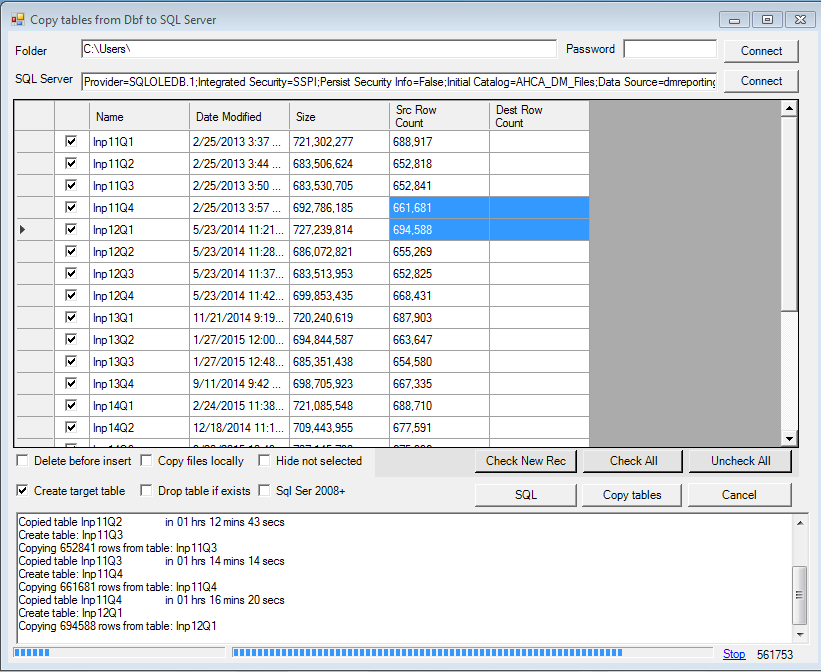
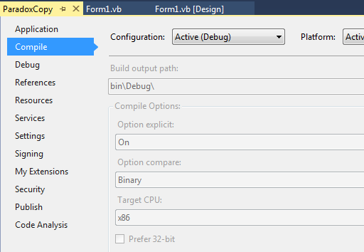

Originally posted here:
<https://www.codeproject.com/Articles/5251705/DBF-to-SQL-Server/>

Application lets you copy tables from folder with DBF files to SQL Server

## Introduction
I developed this application to help me migrate DBFs to SQL Server. I hope someone else will also find this code useful.

## Background
This application is fairly simple: you select the folder where DBF database files reside, select the SQL Server database you want to copy the tables, 
select the tables you want to copy and click "Copy tables". The application will create tables in the SQL server database and copy the data. 
It will also try to copy files locally in case they are located on a network drive.

## Using the Code
The application uses Microsoft Jet OLEDB provider to read data in 32 bit mode. The provider will not work in 64 bit. This is why it is compiled in 32 bit mode.

DBF files can be password protected. The application uses JET OLEDB connection string property "Jet OLEDB:Database Password" for the password.

- Function "GetDbfRecCount" gets quick record count.
- CopyTableJet function does the actual work of copying data. It will insert 1000 records at a time if you select "SQL Ser 2008+".
- GetCreateTableSqlFromDbf function will create the table in SQL server if it does not exist.
